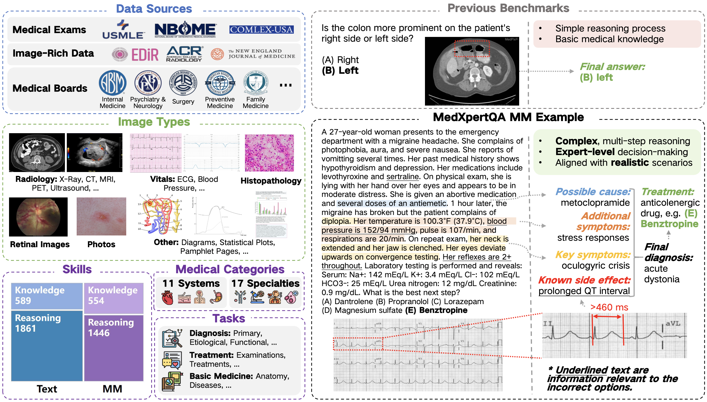
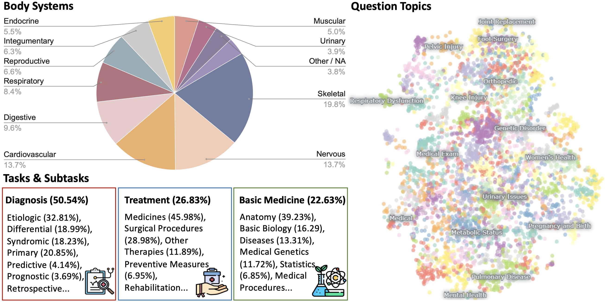
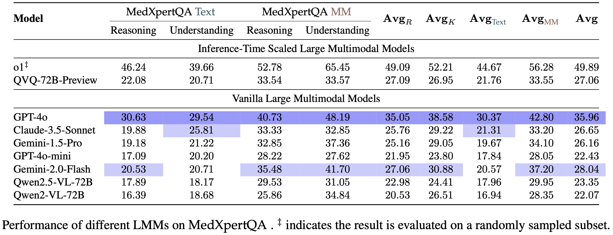
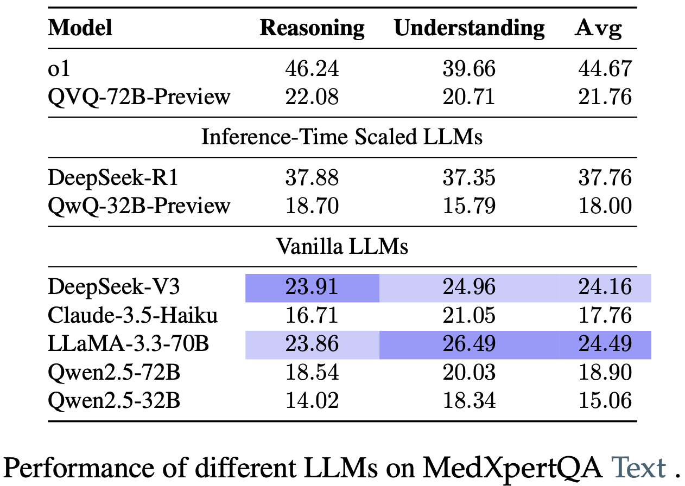

<div align="center">

# MedXpertQA: Benchmarking Expert-Level Medical Reasoning and Understanding

[](https://arxiv.org/abs/2501.18362)  [](https://huggingface.co/datasets/TsinghuaC3I/MedXpertQA)  [](https://medxpertqa.github.io)  [](https://github.com/TsinghuaC3I/MedXpertQA/blob/main/LICENSE)

</div>

<div align="center">
  <p>
    <a href="#news" style="text-decoration: none; font-weight: bold;">🔥 News</a> •
    <a href="#overview" style="text-decoration: none; font-weight: bold;">📖 Overview</a> •
    <a href="#features" style="text-decoration: none; font-weight: bold;">✨ Features</a> •
    <a href="#benchmark-adoption" style="text-decoration: none; font-weight: bold;">🌍 Adoption</a> •
    <a href="#leaderboard" style="text-decoration: none; font-weight: bold;">📊 Leaderboard</a>
  </p>
  <p>
    <a href="#usage" style="text-decoration: none; font-weight: bold;">🔧 Usage</a> •
    <a href="#contact" style="text-decoration: none; font-weight: bold;">📨 Contact</a> •
    <a href="#citation" style="text-decoration: none; font-weight: bold;">🎈 Citation</a>
  </p>
</div>

> 🌍 MedXpertQA has been included in official evaluations of foundation models from **Google DeepMind, Meta Superintelligence Labs, ByteDance Seed, and Alibaba Qwen**. See [Benchmark Adoption](#benchmark-adoption).

## 🔥News

- **🎉 [2025-05-06] MedXpertQA paper is accepted to [ICML 2025](https://icml.cc/Conferences/2025)!**
- **🛠️ [2025-04-08] MedXpertQA has been successfully integrated into [OpenCompass](https://github.com/open-compass/opencompass)! Check out the [PR](https://github.com/open-compass/opencompass/pull/2002)!**
- **💻 [2025-02-28] We release the evaluation code! Check out the [Usage](#usage).**
- **🌟 [2025-02-20] [Leaderboard](https://medxpertqa.github.io) is on! Check out the results of o3-mini, DeepSeek-R1, and o1!**
- **🤗 [2025-02-09] We release the MedXpertQA [dataset](https://huggingface.co/datasets/TsinghuaC3I/MedXpertQA).**
- **🔥 [2025-01-31] We introduce [MedXpertQA](https://arxiv.org/abs/2501.18362), a highly challenging and comprehensive benchmark to evaluate expert-level medical knowledge and advanced reasoning!**

## 📖Overview

**MedXpertQA** includes 4,460 questions spanning 17 specialties and 11 body systems. It includes two subsets, **MedXpertQA Text** for text medical evaluation and **MedXpertQA MM** for multimodal medical evaluation. The following figure presents an overview. 
<details>
<summary>
  More Details
</summary>
The left side illustrates the diverse data sources, image types, and question attributes.
The right side compares typical examples from MedXpertQA MM and a traditional benchmark (VQA-RAD).
</details>

<p align="center">
   
</p>


## ✨Features

- **Next-Generation Multimodal Medical Evaluation:** MedXpertQA MM introduces expert-level medical exam questions with diverse images and rich clinical information, including patient records and examination results, setting it apart from traditional medical multimodal benchmarks with simple QA pairs generated from image captions.
- **Highly Challenging:** MedXpertQA introduces high-difficulty medical exam questions and applies rigorous filtering and augmentation, effectively addressing the insufficient difficulty of existing benchmarks like MedQA. The Text and MM subsets are currently the most challenging benchmarks in their respective fields.
- **Clinical Relevance:**  MedXpertQA incorporates specialty board questions to improve clinical relevance and comprehensiveness by collecting questions corresponding to 17/25 member board exams (specialties) of the American Board of Medical Specialties. It showcases remarkable diversity across multiple dimensions.

<p align="center">
   
</p>

- **Mitigating Data Leakage:** We perform data synthesis to mitigate data leakage risk and conduct multiple rounds of expert reviews to ensure accuracy and reliability.
- **Reasoning-Oriented Evaluation:** Medicine provides a rich and representative setting for assessing reasoning abilities beyond mathematics and code. We develop a reasoning-oriented subset to facilitate the assessment of o1-like models.

## 🌍Benchmark Adoption

The following official model releases, model cards, and technical reports report evaluation results on **MedXpertQA**:

### Foundation Models

| Organization | Model Releases |
| --- | --- |
| Google DeepMind | [Gemini 3 Pro](https://blog.google/innovation-and-ai/technology/developers-tools/gemini-3-pro-vision/), [Gemma 4](https://ai.google.dev/gemma/docs/core/model_card_4), [DiffusionGemma](https://ai.google.dev/gemma/docs/diffusiongemma/model_card) |
| Meta Superintelligence Labs | [Muse Spark](https://ai.meta.com/blog/introducing-muse-spark-msl/) |
| ByteDance Seed | [Seed2.0](https://seed.bytedance.com/en/seed2) |
| Alibaba Qwen | [Qwen3.5](https://qwen.ai/blog?id=qwen3.5) |

### Medical-Specialized Models

| Organization | Model Releases |
| --- | --- |
| Google DeepMind | [MedGemma 1.5](https://developers.google.com/health-ai-developer-foundations/medgemma/model-card), [MedGemma 1](https://developers.google.com/health-ai-developer-foundations/medgemma/model-card-v1) |
| Alibaba DAMO Academy | [Lingshu](https://huggingface.co/lingshu-medical-mllm/Lingshu-7B) |
| Alibaba Quark Medical Team | [QuarkMed](https://arxiv.org/html/2508.11894v1) |
| LG AI Research | [EXAONE 4.5](https://github.com/LG-AI-EXAONE/EXAONE-4.5) |
| ByteDance XiaoHe Medical AI | [MedXIAOHE](https://arxiv.org/html/2602.12705) |
| ACTAVA | [Cura 1T](https://www.actava.ai/cura) |
| MBZUAI | [MedMO](https://huggingface.co/MBZUAI/MedMO-8B) |
| InfiX AI | [InfiMed-Foundation](https://huggingface.co/InfiX-ai/InfiMed-Foundation-4B) |
| JD Health International | [Citrus-V](https://github.com/jdh-algo/Citrus-V) |

*Evaluation settings and evaluated subsets may differ across reports. Please refer to each source for details. The second table includes both medical-specialized systems and other advanced models that report MedXpertQA results.*

## 📊Leaderboard

We evaluate 17 leading proprietary and open-source LMMs and LLMs including advanced inference-time scaled models with a focus on the latest progress in medical reasoning capabilities.
**Further details are available in the [leaderboard](https://medxpertqa.github.io) and the [paper](https://arxiv.org/abs/2501.18362).**

<p align="center">
  
  
</p>


## 🔧Usage

1. Clone the Repository:

```
git clone https://github.com/TsinghuaC3I/MedXpertQA
cd MedXpertQA/eval
```

2. Install Dependencies:

```
pip3 install -r requirements.txt
```

3. Inference:

```
bash scripts/run.sh
```

> The *run.sh* script performs inference by calling *main.py*, which offers additional features such as multithreading. Additionally, you can modify *model/api_agent.py* to support more models.

4. Evaluation:

We provide a script *eval.ipynb* to calculate accuracy on each subset.

> [!NOTE]
> Please use this script when evaluating the **QVQ** and **DeepSeek-R1**. Through case studies, we found that the answer cleaning function in the *utils.py* is unsuitable for these two models.

5. Evaluate with [EvalScope](https://github.com/modelscope/evalscope) (optional):

EvalScope provides a standardized evaluation workflow for OpenAI-compatible model endpoints, with saved predictions, scoring, and reports.

```bash
evalscope eval \
    --model YOUR_MODEL \
    --api-url OPENAI_API_COMPAT_URL \
    --api-key EMPTY_TOKEN \
    --datasets medxpertqa \
    --limit 10  # Remove this line for formal evaluation
```

See the [EvalScope MedXpertQA guide](https://evalscope.readthedocs.io/en/latest/benchmarks/medxpertqa.html) for additional setup options, including text and multimodal subsets.

## 📨Contact

- Shang Qu: [lindsay2864tt@gmail.com](mailto:lindsay2864tt@gmail.com)

- Ning Ding: [dn97@mail.tsinghua.edu.cn](mailto:dn97@mail.tsinghua.edu.cn)

## ⚖️License

This project is licensed under the [MIT License](https://github.com/TsinghuaC3I/MedXpertQA/blob/main/LICENSE).

## 🎈Citation

If you find our work helpful, please use the following citation.

```bibtex
@article{zuo2025medxpertqa,
  title={Medxpertqa: Benchmarking expert-level medical reasoning and understanding},
  author={Zuo, Yuxin and Qu, Shang and Li, Yifei and Chen, Zhangren and Zhu, Xuekai and Hua, Ermo and Zhang, Kaiyan and Ding, Ning and Zhou, Bowen},
  journal={arXiv preprint arXiv:2501.18362},
  year={2025}
}
```
